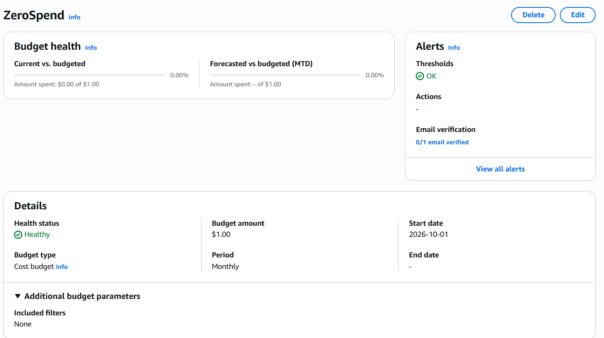
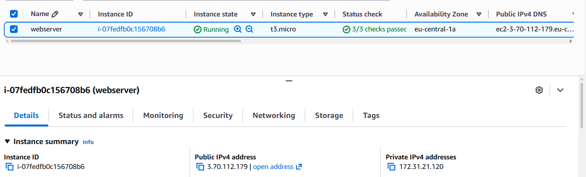
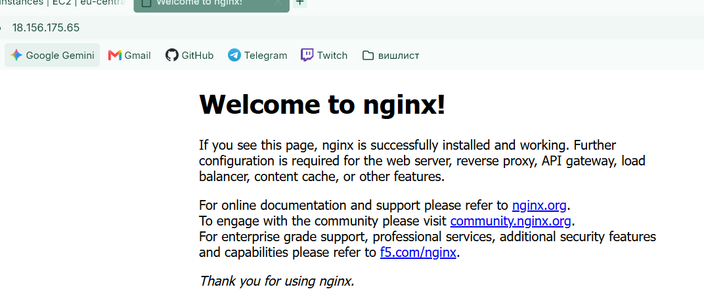
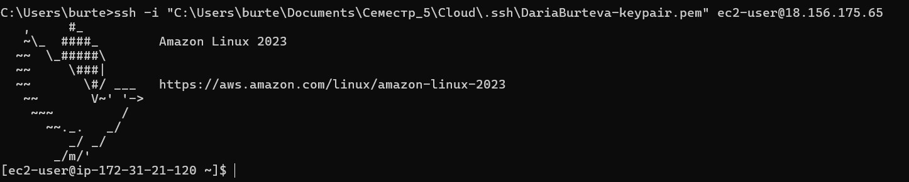
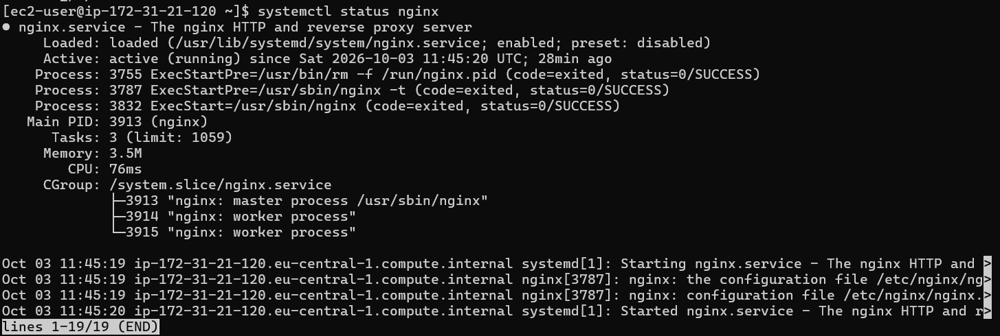
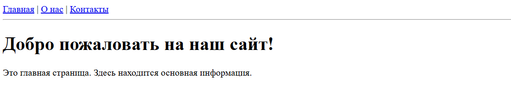
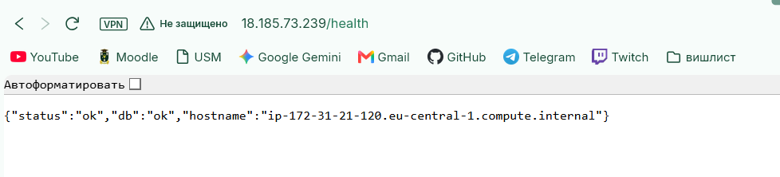
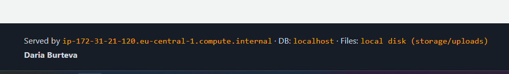
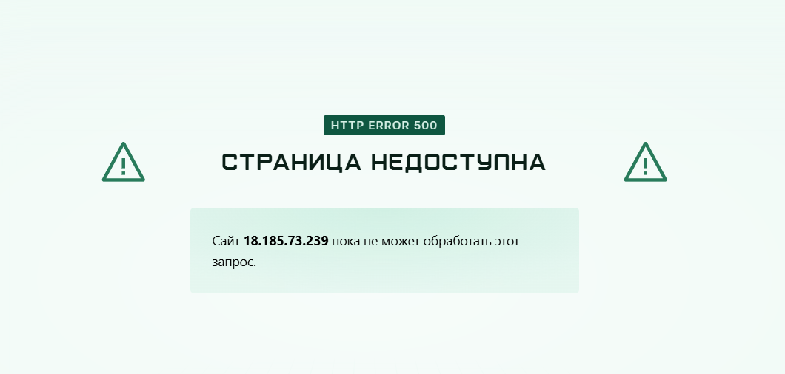

# Отчёт по лабораторной работе: Развёртывание приложения в AWS

**ФИО:** Бурцева Дарья  
**Группа:** IA2403  
**Специальность:** Прикладная информатика  
**Выбранный уровень:** Продвинутый  
**Выбранное приложение:** open_capsules_php_oop  
**Вариант деплоя:** Вариант A   
**Ссылка на репозиторий:** https://github.com/burtevadaria-cloud/timecapsule

---

## 1. Скриншоты базового уровня

*Задание 1: Настроенный бюджет ZeroSpend в списке Budgets.*

*Задание 2: Экземпляр webserver в состоянии Running с пройденными проверками (виден Public IP/ID).*

*Задание 2: Стартовая страница nginx в браузере по публичному IP.*

*Задание 3: Вкладка Monitoring и фрагмент System log с логами установки nginx.*

*Задание 4: Успешное подключение по SSH и вывод systemctl status nginx.*

*Задание 5: Статический сайт в браузере и вывод ls -l /usr/share/nginx/html в терминале.*

*Задание 6: Команда aws ec2 stop-instances в терминале/CloudShell и её вывод.*

---

## 2. Скриншоты продвинутого уровня

*Задание 9: Успешное подключение к БД по паролю и вывод psql -c "SELECT 1;".*

*Задание 10: Успешное выполнение скрипта php bin/init-db.php.*

*Задание 11: Успешный вывод sudo nginx -t в терминале и ответ {"status":"ok"...} по адресу /health.*

*Задание 13: Новая версия приложения с добавленным именем в подвале (footer).*

*Задание 13: Ошибка 500 после сломанного деплоя, лог git revert и восстановленный сайт.*

---

## 3. Архитектура и ADR

**Схема архитектуры развёртывания:**

**Architecture Decision Record:**
Файл с описанием выбора способа деплоя сохранён в репозитории: 
[docs/adr/0001-deploy-method.md][(https://github.com/burtevadaria-cloud/timecapsule/blob/main/docs/adr/0001-deploy-method.md))

---

## 4. Ответы на контрольные вопросы

### Вопросы из заданий (Часть 1 и 2)
**Задание 1: Что разрешает политика AdministratorAccess? Почему для повседневной работы нельзя использовать root?**
Политика AdministratorAccess предоставляет полный доступ ко всем сервисам AWS. Root-аккаунт обладает абсолютными правами, включая удаление аккаунта и изменение платежных данных, поэтому для повседневной работы используют IAM-пользователей с ограниченными правами.

**Задание 2: Что такое User data и когда выполняется этот скрипт? Выполнится ли он повторно после перезагрузки экземпляра?**
User data — это скрипт автоматической настройки, который передается инстансу при создании. Он выполняется от имени суперпользователя (root) только один раз при самом первом запуске виртуальной машины. При обычных перезагрузках сервера он повторно не выполняется.

**Задание 3: Какая из проверок укажет на проблему, которую можете исправить вы, а какая на проблему на стороне AWS?**
Проверка `Instance status check` указывает на проблемы внутри виртуальной машины (например, неверные настройки сети или зависание ОС), которые можно исправить самостоятельно. Проверка `System status check` отражает физические проблемы с самим сервером или инфраструктурой AWS, которые решает провайдер.

**Задание 3: В каких случаях стоит включать детальный мониторинг?**
Детальный мониторинг необходим в production-средах для критически важных приложений. Получение метрик раз в минуту позволяет системам вроде Auto Scaling оперативно реагировать на резкие скачки нагрузки и быстро запускать новые серверы.

**Задание 4: Почему для входа на экземпляр EC2 используется ключ, а не пароль?**
Ключи обеспечивают криптографически надежную аутентификацию и полностью защищают сервер от атак полного перебора. Взломать или подобрать закрытый SSH-ключ технически практически невозможно, в отличие от текстового пароля.

**Задание 5: Что делает команда scp и чем она похожа на ssh?**
Команда `scp` используется для безопасного копирования файлов между компьютерами по сети. Она похожа на `ssh`, так как работает поверх того же криптографического протокола, используя те же порты (22) и те же ключи доступа для защиты данных при передаче.

**Задание 6: Чем Stop отличается от Terminate? За что вы продолжаете платить, пока экземпляр остановлен?**
При `Stop` виртуальная машина ставится на паузу и освобождает вычислительные мощности, но сохраняет свой жесткий диск (EBS). При `Terminate` машина полностью удаляется вместе с данными. В состоянии Stop вы продолжаете платить за аренду места на диске EBS.

**Задание 7: Почему папка vendor/ и файл .env не попали в репозиторий? Найдите ответ в файле .gitignore.**
Оба этих пути явно прописаны в конфигурационном файле `.gitignore`. Это сделано для того, чтобы в репозиторий не попадали сторонние тяжелые библиотеки (`vendor/`) и конфиденциальные данные, такие как пароли к базе данных (`.env`).

**Задание 8: Почему мы устанавливаем эти пакеты вручную, а не добавляем их в User data?**
В рамках учебной работы ручная установка позволяет лучше понять назначение каждого пакета и проконтролировать процесс сборки сервера. Автоматизация через User data используется тогда, когда конфигурация сервера уже полностью отлажена.

**Задание 10: Почему пароль к базе данных хранится в файле .env на сервере, а не в коде в репозитории? Почему публичный репозиторий безопасен для этого приложения?**
Хранение паролей в коде публичного репозитория приведет к их немедленной компрометации любым пользователем интернета. Публичный репозиторий безопасен, так как он содержит только универсальный исходный код, а все конфиденциальные настройки (адреса, пароли) вынесены в защищенный локальный файл на сервере.

**Задание 12: git pull заменяет файлы по одному. Что может увидеть посетитель, который откроет сайт в этот момент? Что случится с сайтом, если после git pull не выполнится composer install?**
Во время загрузки посетитель может столкнуться со сломанным функционалом, так как часть файлов будет новой, а часть старой. Если `composer install` не выполнится, приложение может выдать фатальную ошибку из-за отсутствия новых классов, требуемых обновленным кодом.

**Задание 13: Почему /health отвечает ok, хотя главная страница не работает? Что на самом деле проверяет этот адрес? Чего не хватает такой проверке?**
Адрес `/health` обычно выполняет изолированный и легковесный API-запрос, проверяя только доступность базовых компонентов, таких как подключение к БД. Он не рендерит HTML-шаблоны (Views), в которых и была допущена синтаксическая ошибка. 

**Задание 13: Сколько времени сайт был сломан? Из каких шагов сложилось это время? Как можно было бы сократить его?**
Сайт был недоступен с момента окончания сломанного деплоя до завершения повторного деплоя исправленной версии. Это время сложилось из ручного обнаружения ошибки, локального отката (`git revert`), пуша на GitHub и выполнения `git pull`. Сократить его можно с помощью Blue-Green развертывания (когда трафик переключается только на уже протестированный код) и автоматических тестов.

### Контрольные вопросы продвинутого уровня

**Как проходит запрос от браузера до базы данных в вашем развёртывании? Какую роль играет каждая программа?**  
Браузер отправляет HTTP-запрос веб-серверу nginx. Если нужна статика, nginx отдает её сам; если нужен динамический контент - передает запрос через сокет в PHP-FPM. PHP-FPM выполняет логику приложения, делает запросы к PostgreSQL для чтения/записи данных, формирует готовую HTML-страницу и возвращает её nginx, который отправляет результат клиенту.

**Почему сервер может скачивать код из репозитория, но не может отправлять в него изменения? Почему для сервера это правильно?**  
Сервер клонирует код по HTTPS-протоколу из публичного репозитория, что дает доступ только на чтение; для записи требуется токен или ключ. Это правильно с точки зрения безопасности: если сервер будет скомпрометирован злоумышленником, тот не сможет "отравить" оригинальный репозиторий вредоносным кодом.

**Что произойдёт с загруженными пользователями файлами, если удалить экземпляр EC2? Как это связано с тем, что вы знаете об EBS?**  
Если удалить экземпляр EC2, его корневой диск по умолчанию будет уничтожен вместе со всеми данными. Так как загруженные файлы (папка `storage`) физически хранятся на этом подключенном EBS-томе, они будут утеряны.

**Что общего у вашего deploy.sh или последовательности команд варианта A с тем, что делают системы CI/CD? Чего в вашем процессе ещё не хватает?**  
Оба подхода последовательно собирают приложение, скачивают обновления, применяют миграции и перезапускают сервисы. Нашему процессу не хватает автоматического запуска по триггеру, прохождения автоматизированных тестов перед деплоем и рассылки уведомлений о статусе сборки.
